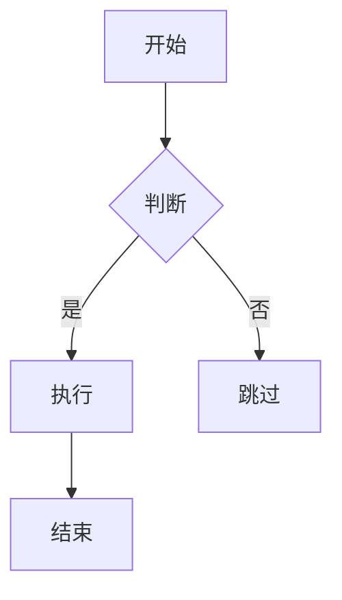

# Obsidian Flavored Markdown

创建和编辑 Obsidian 风格 Markdown，支持所有 Obsidian 特有语法。

## 快速参考

| 元素 | 语法 | 示例 |
|------|------|------|
| 粗体 | `**text**` | **粗体** |
| 斜体 | `*text*` | *斜体* |
| 高亮 | `==text==` | ==高亮== |
| 代码 | `` `code` `` | `code` |
| 删除线 | `~~text~~` | ~~删除~~ |

## 内链 (Wikilinks)

| 语法 | 说明 |
|------|------|
| `[[Note Name]]` | 链接到笔记 |
| `[[Note\|显示文本]]` | 自定义显示文字 |
| `[[Note#Heading]]` | 链接到标题 |
| `[[Note#^block-id]]` | 链接到块 |

## Callouts (提示框)

| 类型 | 别名 | 描述 |
|------|------|------|
| `note` | - | 蓝色，铅笔图标 |
| `info` | - | 蓝色，信息图标 |
| `tip` | hint, important | 青色，火焰图标 |
| `warning` | caution | 橙色，警告图标 |
| `danger` | error | 红色，闪电图标 |
| `success` | check, done | 绿色，对勾图标 |
| `question` | help, faq | 黄色，问号图标 |

```markdown
> [!tip] 自定义标题
> 这是一个提示框。

> [!faq]- 默认折叠
> 点击展开内容。

> [!note] 外部callout
> > [!note] 内部callout
> > 嵌套内容
```

## 嵌入 (Embeds)

| 语法 | 说明 |
|------|------|
| `![[Note]]` | 嵌入笔记 |
| `![[image.png]]` | 嵌入图片 |
| `![[image.png\|300]]` | 指定宽度 |
| `![[doc.pdf]]` | 嵌入PDF |
| `![[doc.pdf#page=3]]` | 指定页面 |

## 属性 (Frontmatter)

```yaml
---
title: 笔记标题
date: 2024-01-15
tags:
  - tag1
  - nested/tag2
status: in-progress
priority: high
completed: false
---
```

## 标签 (Tags)

```markdown
#tag
#nested/tag
#tag-with-dashes

---
tags:
  - tag1
  - nested/tag2
---
```

## 表格

```markdown
| 左对齐 | 居中 | 右对齐 |
|:------|:----:|------:|
| 内容 | 内容 | 内容 |
```

## 数学公式 (LaTeX)

| 语法 | 说明 |
|------|------|
| `$x^2$` | 上标 |
| `$x_i$` | 下标 |
| `$\frac{a}{b}$` | 分数 |
| `$\sqrt{x}$` | 平方根 |
| `$\sum_{i=1}^{n}$` | 求和 |
| `$\int_a^b$` | 积分 |

## Mermaid 图表



## 任务列表

```markdown
- [ ] 未完成任务
- [x] 已完成任务
- [ ] 带子任务
  - [ ] 子任务1
```

## 代码块

| 语法 | 说明 |
|------|------|
| ```` ```js ` ```` | JavaScript 高亮 |
| ```` ```python ` ```` | Python 高亮 |
| ```` ```json ` ```` | JSON 高亮 |

## Changelog

### v1.0.0 (2026-02-08)
- 基础格式化语法
- Wikilinks 内链
- Callouts 提示框
- 嵌入功能
- 属性 Frontmatter
- Mermaid 图表支持
