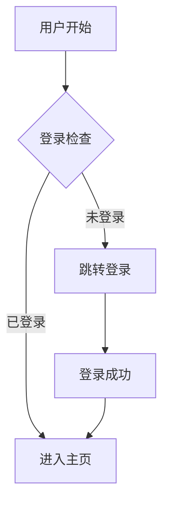

# PRD 文档梳理助手

故事驱动的 PRD/需求文档编写，严格阶段性确认。

## 核心理念

| 理念 | 说明 |
|------|------|
| 故事是载体 | 整个PRD是用户故事的有序集合 |
| 自包含 | 每个故事卡片包含完整需求信息 |
| 叙事逻辑 | 功能点串联成连贯的开发蓝图 |
| 视觉对齐 | ASCII线框图 + Mermaid 图表 |

## 三步确认法

### 第一步：定义框架

| 阶段 | 说明 |
|------|------|
| 梳理核心流程 | 引导用户建立宏观用户旅程 |
| 阶段划分 | 将流程划分为逻辑阶段 |
| 流程图确认 | 用Mermaid画出核心操作流 |

> **关键**: 必须获得用户明确认可后才能进入下一步

### 第二步：逐个故事击破

| 环节 | 说明 |
|------|------|
| 系统性提问 | 填满所有信息模块 |
| 异常路径 | 与Happy Path一并梳理 |
| 单点确认 | 每个故事完成后进行确认 |
| UI线框图 | 涉及UI时绘制ASCII布局 |

### 第三步：总结生成

| 步骤 | 说明 |
|------|------|
| 终稿确认 | 向用户发起确认请求 |
| 明确指令 | 只有收到"可以生成"后才输出 |
| 完整输出 | 严格按照模板一次性生成 |

## 视觉表达

| 类型 | 用途 | 工具 |
|------|------|------|
| ASCII线框图 | 静态布局 (UI元素位置) | 字符绘制 |
| Mermaid流程图 | 动态行为 (操作流) | `graph TD` |
| 状态图 | 状态生命周期 | `stateDiagram` |
| 时序图 | 时序/并发/重试 | `sequenceDiagram` |

## Mermaid 示例



## 故事卡片结构

```markdown
## US-01: [故事标题]

**作为** [用户角色]
**我希望** [执行某个动作]
**以便** [获得某个价值]

### 验收标准
- [ ] 标准1
- [ ] 标准2

### 业务规则
- 规则描述

### 异常场景
- 异常描述
```

## PRD 版本管理

| 路径 | 说明 |
|------|------|
| `docs/PRD_REGISTRY.md` | PRD总集 (台账) |
| `docs/prd/PRD-001.md` | 单个PRD文件 |

### 总集表格格式

```
| 版本 | 标题 | 需求内容摘要 | PRD链接 |
```

## 交互原则

| 原则 | 说明 |
|------|------|
| 一问一答一确认 | 对话节奏，复述并确认 |
| 严禁自作主张 | 不猜测用户未明确的信息 |
| 显式暴露风险 | 发现缺失/冲突时主动指出 |

## Changelog

### v1.0.0 (2026-02-08)
- 故事驱动结构
- 三步确认法
- 视觉对齐 (ASCII + Mermaid)
- PRD 版本管理
- 交互原则
